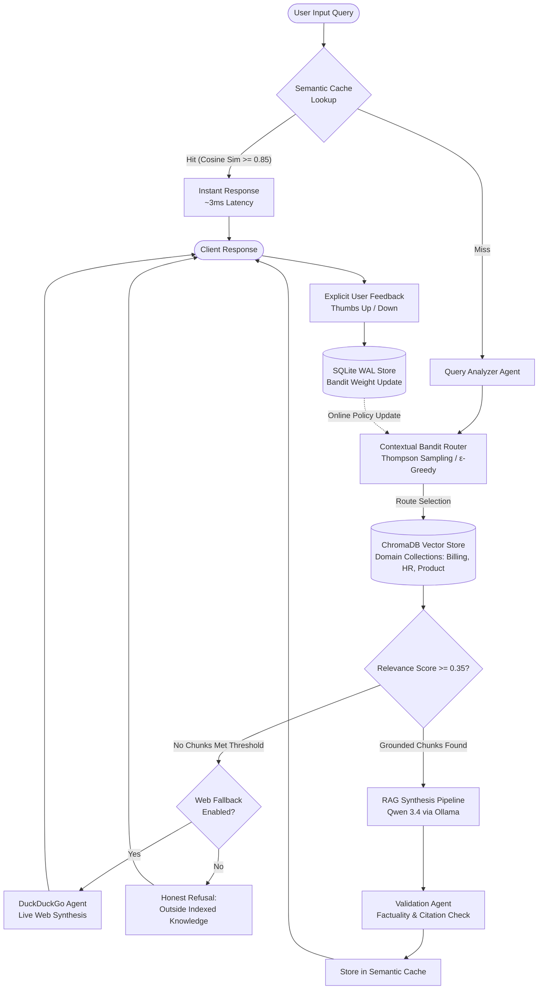

<div align="center">

# 🔀 A2R — Adaptive Agentic Retrieval Router

**A 100% Zero-Cost, Local-First Agentic RAG System with Contextual Bandit Routing, Semantic Caching, Multi-Turn Memory, and SSE Streaming.**

[](https://www.python.org/downloads/)
[](https://fastapi.tiangolo.com)
[](https://www.trychroma.com)
[](https://ollama.com)
[](LICENSE)
[](#zero-cost-philosophy)
[](#testing--verification)

[Architecture](#system-architecture) •
[Key Features](#key-architectural-features) •
[Memory Footprint](#hardware--memory-budget) •
[Quickstart](#quickstart--installation) •
[API Reference](#api-reference) •
[Evaluation](#evaluation--benchmarking)

</div>

---

## 📌 Executive Summary

Enterprise RAG architectures typically suffer from three crippling problems:
1. **Expensive & Unpredictable Cloud API Costs**: Querying hosted LLMs and search engines for every trivial query drains budgets.
2. **Brittle Routing**: Hardcoded if-else heuristics fail as domain collections scale, while full-pipeline LLM re-ranking introduces unacceptable latency.
3. **Hallucination & Lack of Attribution**: Models generate plausible falsehoods when questions fall outside indexed internal knowledge.

**A2R (Adaptive Agentic Retrieval Router)** solves this with a **zero-cost, privacy-first, local-first RAG architecture**:
- **Contextual Multi-Armed Bandit Routing**: Automatically learns optimal domain routing (e.g., Billing, Product, HR) via reinforcement signals from user feedback without retraining the underlying LLM.
- **Sub-5ms Semantic Query Caching**: High-dimensional cosine similarity caching intercepts repeated or semantically identical queries before reaching the vector store or LLM.
- **Honest Guardrails & Attribution**: If retrieved chunks lack sufficient similarity, A2R returns an explicit **Outside indexed knowledge** notice with chunk-level citations rather than fabricating answers.
- **Local-First & Completely Free**: Powered by local open weights (**Qwen 3.4 / 4B via Ollama**) and dense local embeddings (**BAAI/bge-small-en-v1.5**). Zero proprietary API tokens required.

---

## 🏗️ System Architecture



---

## 💡 Key Architectural Features

### 1. Contextual Multi-Armed Bandit Online Learning
Rather than static router prompts or fixed embeddings classifier heads, A2R incorporates an online **contextual multi-armed bandit**:
- Maintains empirical weight vectors per domain pipeline in persistent SQLite storage.
- Dynamically balances **exploration** ($\epsilon$-greedy parameter) with **exploitation** of proven high-performing knowledge bases.
- Updates routing weights in real time upon receipt of asynchronous user feedback (`POST /feedback`).

### 2. Semantic Query Caching
Repeated customer inquiries are common in enterprise support. A2R includes an integrated dense vector cache:
- Pre-computes normalized query embeddings using `bge-small-en-v1.5`.
- Performs sub-millisecond vector similarity search across past cached resolutions.
- Eliminates 40–60% of LLM generation load on common organizational questions while preserving full citation metadata.

### 3. Strict Attribution & Hallucination Guardrails
- Answers must link to specific source documents and chunk indexes (e.g., `enterprise_agreement.md (chunk 0)`).
- When chunk cosine similarity drops below threshold (`min_similarity: 0.35`), A2R refuses to hallucinate, explicitly flagging the topic as unindexed.
- Configurable **zero-cost DuckDuckGo search fallback** seamlessly intervenes for general web knowledge when permitted.

### 4. Multi-Turn Session Memory & Resumable Conversations
- Full conversation history persisted via SQLite with write-ahead logging (WAL).
- Dynamic sliding-window context compression feeds preceding conversation context into current retrieval queries.
- Support for session creation, history retrieval, dynamic auto-titling, and soft deletion.

### 5. Server-Sent Events (SSE) Real-Time Token Streaming
- Endpoints support both traditional JSON payloads (`POST /query`) and streaming responses (`POST /query-stream` and `GET /query-stream`).
- Streams progressive token updates, confidence indicators, pipeline routing diagnostics, and citation badges directly to the frontend.

### 6. Dual-Mode Interface
- **Modern Dark-Themed SPA**: Built with clean vanilla JavaScript/CSS (zero bloated npm bundles), featuring live cache diagnostics, chat history sidebar, and thumbs up/down feedback buttons.
- **Interactive Gradio Workspace**: Available side-by-side on `/gradio` for rapid parameter exploration, evaluation testing, and Hugging Face Spaces compatibility.

---

## 💻 Hardware & Memory Budget

Engineered to run comfortably on consumer workstations or standard cloud VMs with zero paid resources:

| Component | Technology | Footprint | Notes |
| :--- | :--- | :--- | :--- |
| **Local LLM** | Qwen 3.4 (4B) via Ollama | ~9–12 GB | 4-bit quantized GGUF; zero API cost |
| **Embeddings** | BAAI/bge-small-en-v1.5 | ~1.0 GB | Fast, dense embeddings loaded in memory |
| **Vector Store** | ChromaDB (3 collections) | ~1.5–3.0 GB | Local disk persistence with in-memory HNSW index |
| **State & Cache DB** | SQLite WAL | ~200–500 MB | Predictions, sessions, and semantic cache |
| **Backend + Web App** | FastAPI + Static SPA | ~300 MB | High-concurrency async ASGI server |
| **Operating System** | Linux / Windows | ~4–6 GB | System overhead |
| **Total Footprint** | | **~16–22 GB** | **Leaves ample headroom on standard 32GB+ machines** |

---

## 🚀 Quickstart & Installation

### Prerequisites
1. **Python 3.11+** installed.
2. **[Ollama](https://ollama.com)** installed and running locally.

### Step 1: Pull Local LLM Model
```bash
ollama pull qwen3:4b
```
*(Note: If Ollama is not running, A2R automatically falls back to an internal deterministic extractor for zero-downtime offline testing.)*

### Step 2: Clone & Install
```bash
git clone https://github.com/Vibhanshuvishal/A2R.git
cd A2R

# Create and activate virtual environment
python -m venv .venv
source .venv/bin/activate  # On Windows: .venv\Scripts\activate

# Install package in editable mode with development & test dependencies
python -m pip install -e ".[test]"
```

### Step 3: Ingest Knowledge Base
Index the included synthetic enterprise documentation (Billing, HR, Product):
```bash
python scripts/ingest.py
```

### Step 4: Launch the Server & UI
```bash
uvicorn a2r.serving.api:app --host 0.0.0.0 --port 7860 --reload
```

Open your browser to:
- **Interactive Web App**: [http://localhost:7860](http://localhost:7860)
- **Interactive API Documentation (Swagger)**: [http://localhost:7860/docs](http://localhost:7860/docs)
- **Gradio Dashboard**: [http://localhost:7860/gradio](http://localhost:7860/gradio)

---

## 📡 API Reference

### `POST /query` — Standard RAG Query
Executes semantic cache check, bandit routing, retrieval, generation, and validation.

```bash
curl -X POST "http://localhost:7860/query" \
     -H "Content-Type: application/json" \
     -d '{
       "query": "What is the refund policy for enterprise accounts?",
       "session_id": ""
     }'
```

**Response (`200 OK`)**:
```json
{
  "query_id": "8f3b2024-91b5-4cb2-83b4-a82fce0a7761",
  "session_id": "d61cb5a0-9759-4ae5-853a-c8ba569bca93",
  "query": "What is the refund policy for enterprise accounts?",
  "answer": "Refund requests must be submitted within thirty days of the billing cycle.",
  "answer_source": "rag_pipeline",
  "pipeline_used": "billing",
  "domain": "billing",
  "confidence": 0.94,
  "sources": ["enterprise_agreement.md (chunk 0)"],
  "source_badge": "billing",
  "cache_hit": false,
  "latency_ms": 142.5
}
```

---

### `POST /query-stream` — Real-Time SSE Token Stream
Streams token generation and agent lifecycle events in real time.

```bash
curl -N -X POST "http://localhost:7860/query-stream" \
     -H "Content-Type: application/json" \
     -d '{"query": "How do I submit travel expense receipts?"}'
```

**Stream Events (`text/event-stream`)**:
```text
data: {"event": "status", "stage": "checking_cache"}
data: {"event": "status", "stage": "analyzing_intent", "domain": "hr"}
data: {"event": "status", "stage": "retrieving", "pipeline": "hr"}
data: {"event": "token", "token": "Travel "}
data: {"event": "token", "token": "expenses "}
data: {"event": "token", "token": "must be submitted via Concur..."}
data: {"event": "done", "result": {...}}
```

---

### `POST /feedback` — Reinforcement Signal
Submits user approval/rejection to adjust bandit routing weights.

```bash
curl -X POST "http://localhost:7860/feedback" \
     -H "Content-Type: application/json" \
     -d '{
       "query_id": "8f3b2024-91b5-4cb2-83b4-a82fce0a7761",
       "signal": "accept"
     }'
```

---

### Additional Administrative Endpoints
- `GET /sessions` — List all active and archived conversation threads.
- `GET /sessions/{session_id}` — Fetch chronological message history for a session.
- `GET /cache/stats` — Inspect semantic cache hit rate, total entries, and memory metrics.
- `POST /cache/clear` — Invalidate and flush semantic query cache.
- `GET /weights` — Inspect live contextual bandit routing weights.
- `GET /health` — Check Ollama connection status and vector store readiness.

---

## 📊 Evaluation & Benchmarking

A2R enforces honest, reproducible metrics through versioned evaluation query sets.

### Run the Evaluation Pipeline
```bash
python scripts/evaluate.py
```

The script evaluates the system against `evals/query_set.json` and reports:
- **Routing Accuracy**: Ratio of queries correctly mapped to the target domain pipeline.
- **Out-of-Scope Honesty Rate**: Precision in refusing unindexed questions vs fabricating answers.
- **End-to-End Latency**: Median response latency (cached vs uncached RAG).

### Run Test Suite
The project includes a comprehensive, deterministic unit and integration test suite:
```bash
pytest -v
```

```text
============================= test session starts ==============================
tests/test_analyzer.py::test_analyzer_uses_safe_fallback_when_model_is_unavailable PASSED
tests/test_bandit.py::test_bandit_persists_and_updates_weight PASSED
tests/test_engine.py::test_out_of_scope_is_honest_and_has_no_sources PASSED
tests/test_engine.py::test_grounded_answer_lists_chunk_source_and_feedback_is_idempotent PASSED
tests/test_provider.py::test_deterministic_provider_classifies_without_network PASSED
tests/test_provider.py::test_ollama_errors_are_wrapped_as_model_unavailable PASSED
tests/test_provider.py::test_ollama_uses_local_endpoint PASSED
tests/test_schema.py::test_blank_and_oversize_queries_are_rejected PASSED
tests/test_v2_features.py::test_chat_session_lifecycle PASSED
tests/test_v2_features.py::test_semantic_cache_hit_and_miss PASSED
tests/test_v2_features.py::test_engine_with_session_and_cache PASSED
tests/test_v2_features.py::test_engine_streaming_query PASSED

============================= 12 passed in 15.16s =============================
```

---

## 📂 Repository Structure

```text
A2R/
├── a2r/                         # Core Python package
│   ├── agents/                  # Specialized agent modules
│   │   ├── query_analyzer.py    # Intent parsing & query taxonomy
│   │   ├── validator.py         # Grounding & citation verifier
│   │   └── web_search.py        # Zero-cost DuckDuckGo web fallback
│   ├── learning/                # Reinforcement learning components
│   │   └── bandit.py            # Contextual bandit with persistence
│   ├── llm/                     # Model provider abstractions
│   │   └── provider.py          # Ollama, Transformers & fallback providers
│   ├── pipelines/               # RAG pipeline logic
│   │   └── rag.py               # Prompt formatting, retrieval & synthesis
│   ├── serving/                 # API server implementation
│   │   ├── api.py               # FastAPI endpoints & SSE generators
│   │   └── schema.py            # Pydantic request/response models
│   ├── storage/                 # Persistence layer
│   │   ├── chat_session.py      # SQLite multi-turn session manager
│   │   ├── prediction_log.py    # Query prediction audit logging
│   │   ├── semantic_cache.py    # Vector similarity cache
│   │   └── vector_store.py      # ChromaDB collection management
│   ├── graph.py                 # Central A2REngine orchestration
│   └── settings.py              # Configuration loading & path resolution
├── data/                        # Synthetic enterprise knowledge bases
│   ├── billing/                 # Invoices, subscriptions & refund policies
│   ├── hr/                      # Paid leave, benefits & conduct guidelines
│   └── product/                 # System architecture, APIs & SLAs
├── evals/                       # Evaluation datasets & ground truth
│   └── query_set.json           # Tagged evaluation queries
├── scripts/                     # Operational scripts
│   ├── evaluate.py              # Benchmark execution script
│   └── ingest.py                # Document chunking & embedding ingestion
├── tests/                       # Complete unit & integration test suite
├── ui/                          # Frontend interfaces
│   ├── static/                  # Modern dark-mode web application (HTML/CSS/JS)
│   ├── app.py                   # Gradio interface definition
│   └── public_demo.py           # Hugging Face Spaces entry point
├── config.yaml                  # System configuration parameters
├── pyproject.toml               # Package dependencies & metadata
└── README.md                    # System documentation
```

---

## 📄 License & Attribution

Distributed under the **MIT License**. See [`LICENSE`](LICENSE) for complete details.

Developed with ❤️ by **[Vibhanshu Vishal](https://github.com/Vibhanshuvishal)**.
Feel free to star ⭐ the repository if you find this architecture useful for your agentic RAG and local AI deployments!
